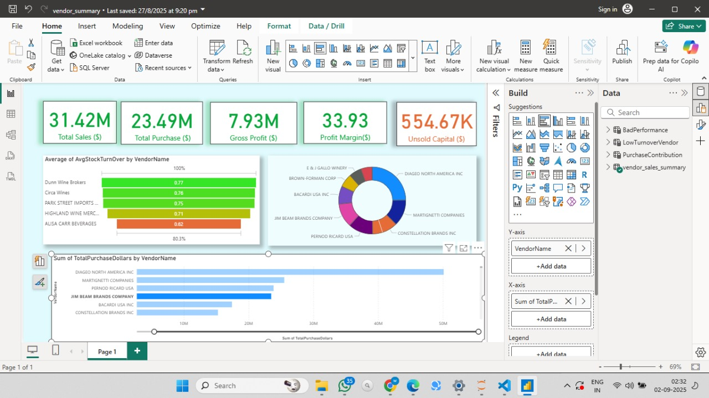

# Vendor Performance Analysis

## 📝 Overview
This project provides an end-to-end analysis of vendor performance using sales and inventory data. The goal is to identify top-performing vendors, analyze product profitability, and provide actionable insights for supply chain optimization. The pipeline involves data ingestion from multiple sources, exploratory data analysis (EDA), data cleaning, and a final interactive dashboard built in Power BI.

---

## 📊 Dashboard Preview
Below is a screenshot of the final Power BI dashboard, which summarizes key performance indicators such as total sales, purchase costs, and profit margins by vendor.

*(Note: To make this image appear, add your `dashboard_screenshot.png` to the `visualizations` folder).*



---

## 🛠️ Tech Stack
* **Data Ingestion & Processing**: Python, Pandas, SQLAlchemy
* **Database**: SQLite
* **Data Analysis & Visualization**: Jupyter Notebook, Seaborn, Matplotlib
* **Interactive Dashboard**: Power BI

---

## 🚀 How to Run This Project

To replicate this analysis, please follow these steps:

1.  **Clone the Repository**
    ```bash
    git clone [https://github.com/your-username/Vendor-Performance-Analysis.git](https://github.com/your-username/Vendor-Performance-Analysis.git)
    cd Vendor-Performance-Analysis
    ```

2.  **Install Dependencies**
    It is recommended to use a virtual environment. Install all the required libraries using the `requirements.txt` file.
    ```bash
    pip install -r requirements.txt
    ```

3.  **Run the Notebooks Sequentially**
    The notebooks are numbered to be run in a specific order:
    * **`notebooks/Ingestion.ipynb`**: This script will ingest the raw data and create the `mydabase.db` SQLite file.
    * **`notebooks/Exploratory_Data_Analysis.ipynb`**: This notebook connects to the database, performs EDA, and creates cleaned summary tables.
    * **`notebooks/Vendor_Performance_Analysis.ipynb`**: This notebook contains the final in-depth analysis and generates insights.

4.  **View the Dashboard**
    Open the `vendor_summary.pbix` file in the `visualizations/` folder using Microsoft Power BI Desktop.

